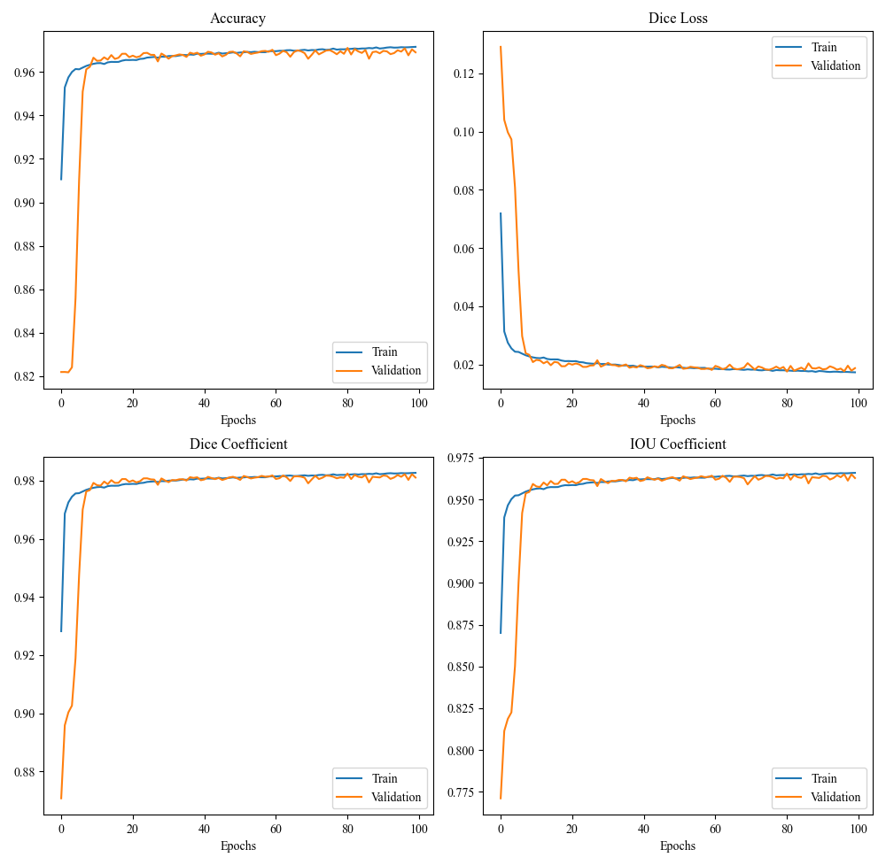
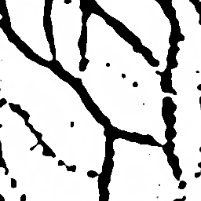

## Attention-Gate-Residual-UNet
This project utilizes a UNet-based model with Attention Gates and Residual Blocks for the segmentation of dorsal hand veins.

### Reference
- UNet Base: [U-Net: Convolutional Networks for Biomedical Image Segmentation](https://arxiv.org/abs/1505.04597)
- Modified UNet Code: [https://github.com/zhixuhao/unet](https://github.com/zhixuhao/unet)
- Attention Gate: [Attention U-Net: Learning Where to Look for the Pancreas](https://arxiv.org/abs/1804.03999)
- Residual Block: [Road Extraction by Deep Residual U-Net](https://arxiv.org/abs/1711.10684)

### Contents
- `data/membrane` - includes training, validation, and testing data
- `main.py` - primary execution script
- `data_loader.py` - responsible for data preprocessing and augmentation
- `blocks.py` - contains building blocks used in the model (attention gates, residual blocks, etc.)
- `model.py` - defines the full model architecture
- `my_metrics.py` - custom evaluation metrics (Dice, IoU, etc.)
- `requirements.txt` - lists environment dependencies

## Dataset
The dataset is from [https://github.com/wilchesf/dorsalhandveins](https://github.com/wilchesf/dorsalhandveins). 

It contains 1,782 dorsal hand vein images, manually cropped to the region of interest (ROI).

The dataset is split in a 7:2:1 ratio for training, validation, and testing:
- Train: `data/membrane/train/image` and `data/membrane/train/label`
- Validation: `data/membrane/val/val_image` and `data/membrane/val/val_label`
- Test: `data/membrane/test`

All images are resized to 256×256.

## Model Architecture
- Main structure:
  


- Residual block:


- Attention gate:


## Training Result



- Prediction example:

| Input Image | Prediction Image |
|-------------|------------------|
|  |  |

## Getting Started
To set up the environment (optional if already installed), run:
```
pip install -r .\requirements.txt
```
Replace the image path in main.py with your input image path, then run:
```
python .\main.py 
```
